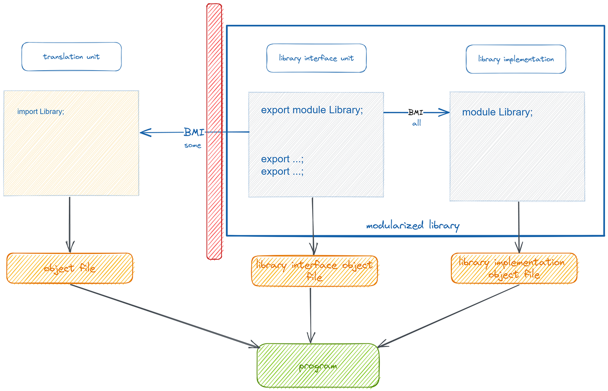

# Moduły

* Dlaczego?
  * potrzeba lepszego skalowania komponentów C++ ( `>1'000'000` LoC)
  * długie czasy kompilacji (duża część kodu jest w plikach `.hpp`)

* Zalety
  * szybsze czasy kompilacji
  * możliwość lepszej hermetyzacji kodu



## Binary Module Interface (BMI)

Plik **Binary Module Interface** zawiera pre-kompilowaną zawartość modułu (wszystkie eksportowane z danego modułu symbole).

## Module unit (jednostka modułowa)

* Do C++20 podstawowym elementem enkapsulującym jednostkę kodu była *jednostka translacji* (*translation unit*)

* Moduły C++ wprowadzają nowy typ jednostki translacji - *jednostkę modułu* (*module unit*)

* Jednostka modułu (*module unit*) jest to jednostka translacji zawierająca deklarację modułu (*module-declaration*)
  * w praktyce jest to dowolny plik, który zawiera na początku deklarację modułu
    * `module Name;`

```{attention}
Moduł C++ może składać się z kilku jednostek modułowych (*module units*)
```

### Rodzaje jednostek modułowych

* **module interface** - jednostka modułowa, w której deklaracja modułu zawiera słowo `export`

  * w ramach jednego modułu może istnieć wiele takich jednostek

* **module implementation** - jednostka modułu, która nie jest jednostką interfejsową
  
  * brak słowa `export` w deklaracji modułu

    ``` c++
    module Name;
    ```

* **module partition** - jednostka modułu, której deklaracja zawiera komponent partycji modułu

#### Partycje modułów

* **module interface partition** - jednostka interfejsu, która jednocześnie jest partycją modułu
  * zawiera w deklaracji zarówno słowo `export` jak i nazwę partycji

    ``` c++
    export module Name:Part1;
    ```

* **module implementation partition** - jednostka implementacji, która jednocześnie jest partycją modułu
  * zawiera komponent partycji, ale bez słowa `export`

    ``` c++
    module Name:Part1;
    ```

Aby mieć dostęp do deklaracji umieszczonej w innej partycji, partycja musi zaimportować żądaną partycję (nie wystarczy import modułu jako całości):

```c++
module Name:Part2;
import :Part1;
```

Podstawowa jednostka modułu (*primary interface unit*) musi importować i re-eksportować partycję w następujący sposób:

```c++
export import :Part1;
export import :Part2;
```

Podstawowa jednostka modułu (*primary interface unit*) może zaimportować *module implementation partition*, ale nie może jej eksportować. Jednostki implementacji nie mogą być eksportowane.

#### Podstawowa jednostka interfejsu

* **primary module interface** - jednostka interfejsu, która eksportuje nazwę modułu
  * nie jest partycją modułu
  * może być tylko jedna w module - wszystkie inne jednostki interfejsu muszą być partycjami modułu

  ``` c++
  export module Name;
  ```

## Nazwy modułów

* Nazwa modułu może być dowolnym identyfikatorem 
  * dozwolone jest użycie wielu symboli `.` (np. `boost.asio.async_completion`)
  * symbol  `.` ma tylko znaczenie wizualne
  * nazwa modułu może być wykorzystana później do czegoś innego (np. przestrzeni nazw, definicji klasy, funkcji, itp.)

```{attention}
Moduły C++ *nie* wprowadzają automatycznie przestrzeni nazw
```

## Eksport z modułów

### Deklaracja export

* Deklaracje eksportu mogą być używane tylko w przestrzeniach nazw (włączając w to globalną przestrzeń nazw)

``` c++
export class Stuff { // Ok
    int a, b;
};

export class MoreStuff {
    int a;
    export int b; // Illegal.
};

export void foo() {
    export int value = get_value(); // Error
}

export void bar(export std::string name) { // Illegal
    // ...
}

template <export typename T>  // Error
export class my_container {};
```

* Deklaracja eksportu musi coś deklarować
* Pierwsza deklaracja eksportowanej encji musi być deklaracją eksportu
  * Późniejsze deklaracje nie muszą używać słowa `export`

``` c++
export class Thing;  // Good

export class Thing;  // Okay, but redundant

class Thing;  // Implicit `export` keyword

class Thing { // Implicit `export` keyword
    int a;
    int b;
};

class SomethingElse; // Good. Not exported.

export class SomethingElse; // Illegal! First declaration is not exported!
```

* Deklaracje eksportu mogą być używane tylko w przestrzeniach nazw (włączając w to globalną przestrzeń nazw)

``` c++
export class Stuff { // Ok
    int a, b;
};

export class MoreStuff {
    int a;
    export int b; // Illegal.
};

export void foo() {
    export int value = get_value(); // Error
}

export void bar(export std::string name) { // Illegal
    // ...
}

template <export typename T>  // Please NO
export class my_container {};
```

### Eksport i przestrzenie nazw

* Deklaracja `using` może być eksportowana. Wyjątkiem są sytuacje gdy alias odnosi się elementu, który wewnętrznie linkowany (*internal linkage* lub *module linkage*)
* Deklaracja `using namespace` nie może być eksportowana

``` c++
namespace Stuff {
   export class Widget {};

   class Gadget {};

   namespace {

      class Gizmo {};

   } // namespace

} // namespace Stuff

export using Stuff::Widget; // OK

export using Stuff::Gadget; // Error

export using Stuff::Gizmo; // Illegal

export using namespace Stuff; // Error
```

* Definicja przestrzeni nazw może być eksportowana, ale wszystkie symbole definiowane w tej przestrzeni muszą spełniać wymagania opisane wcześniej

``` c++
export namespace Foo {

   int eight = 8; // Okay. `eight` is exported as `Foo::eight`.

   static int nine = 0; // Illegal!

   namespace {

      void do_stuff() { // Error!
          //...
      }

   } // namespace
} // namespace Foo
```

#### Niejawny eksport przestrzeni nazw

* Eksport przestrzeni nazw skutkuje tym, że każda deklaracja umieszczone w tej przestrzeni jest niejawnie eksportowana jako symbol należący do tej przestrzeni

``` c++
export namespace Things {
   class Widget { // Implicitly exported as `Things::Widget`
   };

   void foo() { // Implicitly exported as `Things::foo`
   }
}

namespace Items {
   export extern "C" {
      void do_stuff(); // Implicitly exported as Items::do_stuff
   }
   export extern "C++" {
      void do_other_things(); // Implicitly exported as Items::do_other_things
   }
}
```

* Eksportowana encja powoduje niejawny eksport odpowiedniej przestrzeni nazw

``` c++
namespace Foo {

   export void bar(); // Exported as Foo::bar, and namespace `Foo` is now exported

}
```

### Eksportowanie bloku kodu

* Słowo kluczowe `export` może być połączone z blokiem kodu

``` c++
export {

   class Gadget;

   void use(Gadget&);

}
```

### Ograniczenia eksportu

* Nie można eksportować symboli mających *internal linkage*
  * statycznych zmiennych, funkcji
  * zmiennych, funkcji i klas zdefiniowanych w anonimowych przestrzeniach nazw

```c++
namespace {

   // ILLEGAL! This is an anonymous namespace
   export void do_stuff() {
       // ...
   }

   // ILLEGAL! This is an anonymous namespace
   export int five = 5;

   // ILLEGAL! This is an anonymous namespace
   export class stuff {
       // ...
   };
}

// ILLEGAL! This is declared `static`
export static void do_more_stuff() {
    // ...
}

// ILLEGAL! This is declared `static`
export static int twelve = 12;
```

### export import

* Używany wraz z interfejsowymi partycjami modułów (*module partitions*)

``` c++
export module MyModule;

// Add `SomePartition` to our module interface:
export import :SomePartition;
```

* Może też być użyty przy normalnym imporcie zewnętrznego modułu

``` c++
export module MyModule;

export import Widgets; // users who import MyModule
                       // will “implicitly” import Widgets
```

## Import modułów

* Deklaracja importu partycji modułu może odnosić się tylko do partycji należących do tego modułu, który dokonuje importu
* Moduł nie może importować samego siebie
* Importy nie mogą tworzyć cykli

### Reguły importu

* W jednostce modułu (*module unit*), wszystkie importy muszą poprzedzać jakąkolwiek deklarację

``` c++
export module Pets;

import Dogs;

void pet(Dog& d);

import Cats; // Not allowed! Move this import above `pet`
```

* `import` jest specjalnym identyfikatorem, ale wciąż można używać tej nazwy do definiowania np. typów

``` c++
export module Pets;

import Dogs;

class import {};

import i1; // Illegal! `import` declarations must appear in the preamble
::import i2; // Okay. Declares a variable `i2` of type `import`.

class Widget {
    import member; // Okay. No scope-resolution needed.
};
```

### Zależności interfejsów (interface dependency)

* Jednostka translacji ma zależność interfejsu od modułu `U` jeśli zawiera deklarację modułu lub deklarację importu modułu `U` lub jeśli ma zależność interfejsu od jednostki modułu, który ma zależność interfejsu od `U`
* Interface dependencies are transitive


``` c++
// a.cpp
export module Foo;
```

``` c++
// b.cpp
export module Bar;

import Foo;
```

``` c++
// c.cpp - has an interface dependency on a.cpp (transitive)
import Bar;
```

### Visible vs. Reachable

* “Visible” `->` “a candidate for name lookup"

``` c++
export module speech;

export struct Phrase {
    const char* spelling = nullptr;
};

export Phrase get_phrase() {
    return Phrase{"Hello, world!"};
}
```

``` c++
// main.cpp
import speech;

import <iostream>;

int main() {
    Phrase phr = get_phrase();
    std::cout << phr.spelling << '\n';
}
```

* Moduły C++ wprowadzają nowe pojęcie - dostępności (*reachability*)
* Kiedy encja jest dostępna, to wszystkie semantyczne właściwości encji są dostępne, chociaż mogą nie być widoczne (nie biorą udziału w dopasowaniu po nazwie - *name lookup*)
* Co to znaczy w praktyce?
  * Każda widoczna encja jest także dostępna
  * Bycie dostępnym nie implikuje bycia widocznym
  * Jeśli encja jest deklarowana z słowem `export` staje się widoczna
  * Jeśli encja w postaci klasy lub wyliczenia jest dostępna (*reachable*), wtedy jej składowe stają się widoczne (nawet gdy sama nazwa nadrzędnej encji nie jest)

``` c++
// file: secrets.cxx

export module Secrets;

// NOT EXPORTED!
class SecretClass {
public:
    explicit SecretClass(int i) : value(i) {}
    SecretClass(const SecretClass&) = delete;
    SecretClass(SecretClass&&) = default;

    int value = 0;
};

// Export a function that returns our non-exported class type
export SecretClass get_secret() {
    return SecretClass{42};
}
```

``` c++
// file: foo.cpp

import Secrets;

void foo() {
    // ILLEGAL: `SecretClass` is not visible:
    SecretClass s1 = get_secret();

    // Okay: `SecretClass`'s move-constructor is *reachable*:
    auto s2 = get_secret();

    // Okay: The members of the class are *visible*
    int secret_value = s2.value;

    // ILLEGAL: `SecretClass` is not copyable:
    auto s3 = s2;

    // Okay: A move-construction of `SecretClass`:
    auto s4 = std::move(s2);

    // WHOA: Okay: Grab the class and give it a name.
    using NamedClass = decltype(s2);

    // Okay: The constructor of `SecretClass` is reachable, and we've now got
    // a name on the class.
    NamedClass s5{53};
}
```

## Global module fragment

``` c++
module;
// stuff ... [1]
module foo;
// module purview... [2]
```

* `[1]` is tzw. *global module fragment* - wszystko co jest deklarowane/definiowane w tej sekcji jest dołączane do globalnego modułu (a nie do modułu, który jest deklarowany w pliku)

* W tej sekcji mogą znaleźć się **tylko dyrektywy preprocesora**

* Nieprawidłowy kod w sekcji

``` c++
// bar.cpp
module;

extern void foo();  // ILLEGAL: Not a preprocessor directive!

export module bar;

void call_foo() {
    foo();
}
```

* Wszysko OK

``` c++
// foo.h
extern void foo();
```

``` c++
// bar.cpp
module;

#include "foo.h" // // OK: declares `::foo()`

export module bar;

void call_foo() {
    foo();
}
```

## Import plików nagłówkowych

Plik nagłówkowy może być wciągnięty do modułu z użyciem słowa `import`. Główna różnica między importowanym nagłówkiem, a importowanym modułem jest taka, że definicje dyrektyw preprocesora w nagłówku są widoczne natychmiast po instrukcji `import`.

## Prywatny fragment modułu - *private module fragment*

* Wprowadza separację interfejsu od implementacji
* Możemy umieścić implementację w tym samym pliku, ale bez niebezpieczeństwa ekspozycji szczegółów implementacji dla klientów modułu
* Zmiana implementacji w sekcji prywatnej modułu (`module :private`) nie powinna skutkować rekompilacją jednostek importujących ten moduł

``` c++
// [The global module fragment - optional]
module;

#include <stuff.hpp>

// [The module preamble]
export module foo:bar;

export import widgets;
import gadgets;

// [The module interface - optional]
export void do_stuff();

// [The private module fragment - optional]
module :private;

void do_stuff() {
    std::cout << "Howdy!\n";
}

// [The end]
```